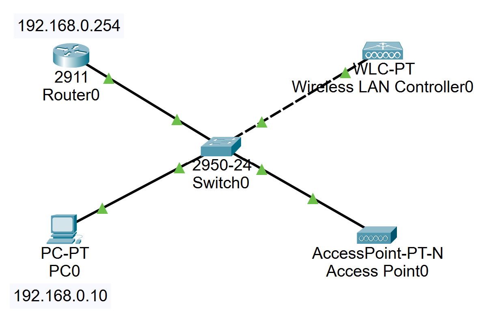
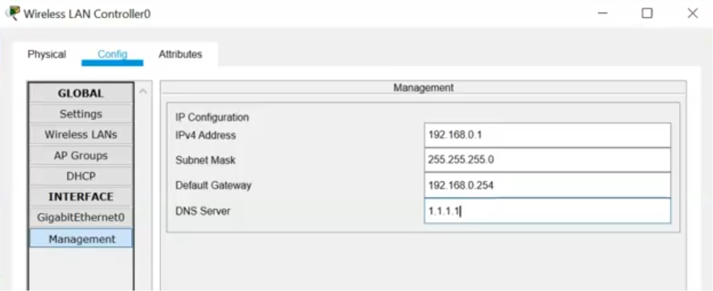
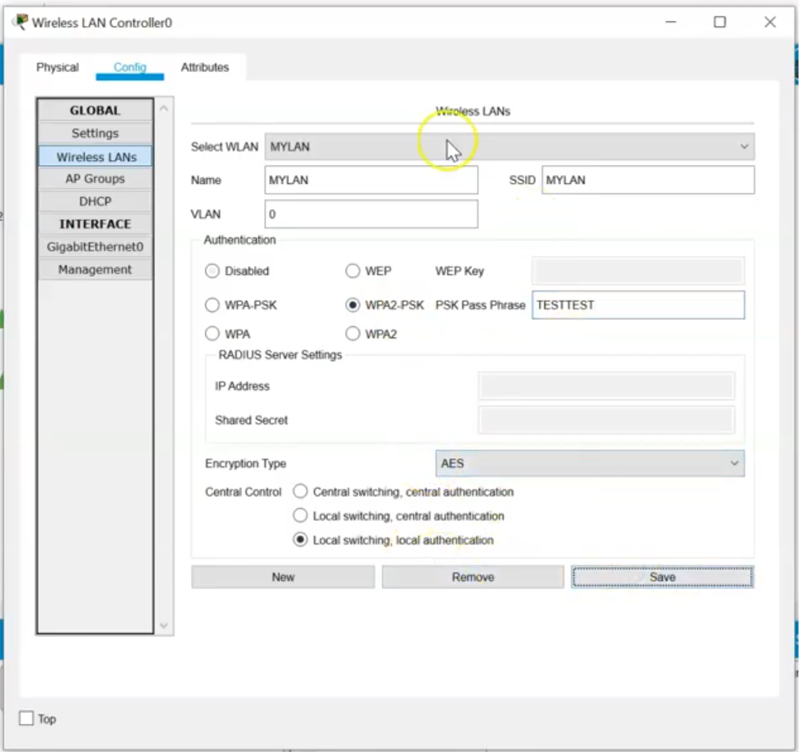
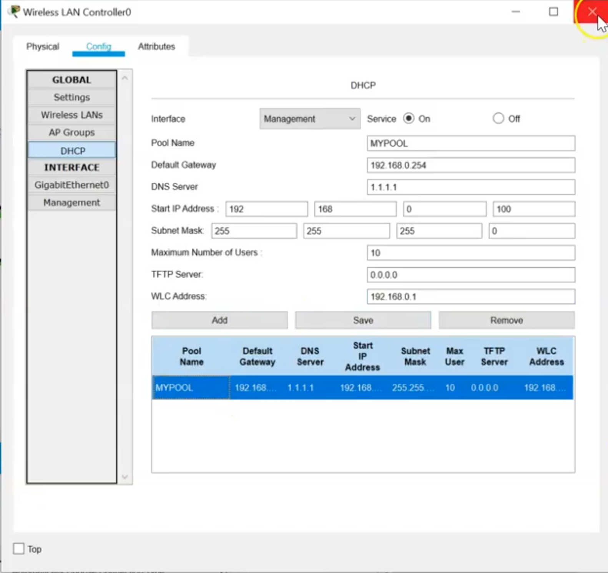
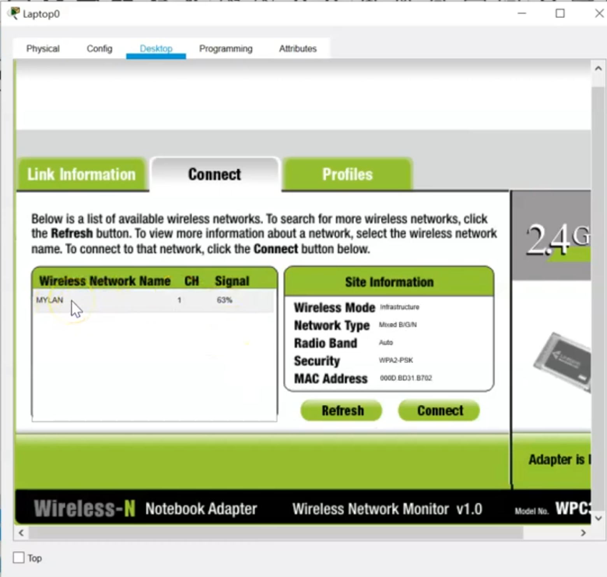
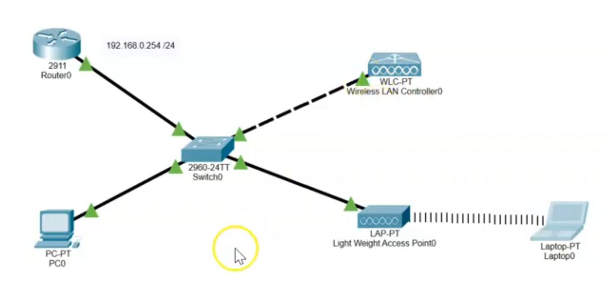

# WLAN Controller

In questo esempio vogliamo riprodurre una situazione reale dove abbiamo una rete wireless che utilizza wireless access point e un server DHCP per assegnare automaticamente gli indirizzi IP ai devices che si connetteranno alla rete wireless protetta con WPA.  

Topologia della rete:  

  

Configurazione del wireless LAN controller:  

  

Setto un SSID per identificare la mia rete e una password  

  

A questo punto configuro il server DHCP in modo tale da poter assegnare gli IP automaticamente agli host collagati:  

  

Aggiungo un laptop e cotrollo se sono disponibili delle reti alle quali potermi collegare:  

  

Configurazione finale con laptop collegato:  

  
