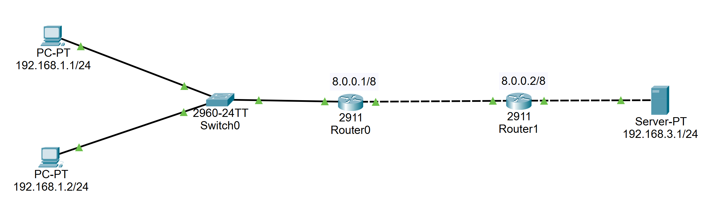

# LAB - Configurazione NAT statico




Una volta configurate le due reti con i parametri visibili nell'immagine passiamo alla configurazione dei router "a mano"  

Necessità di definire quali sono le rotte sulle reti esco da tutte le configurazioni del router digitando  
`exit`  

fino a quando non avrò  
`Router#`  

A questo punto visualizziamo la configurazione  
`sh run`  

e le rotte  
`sh ip route`

Passiamo ora alla configurazione (Router0) delle rotte statiche per raggiungere la rete 192.168.3.0 attraversando il router 8.0.0.2  

```bash
conf t
ip route 192.168.3.0 255.255.255.0 8.0.0.2
do sh ip route
```  

Analogamente con l'altro router (Router1)  

```bash
ip route 192.168.1.0 255.255.255.0 8.0.0.1
do sh ip route
```

Proviamo a "pingare" da un pc di una rete al pc dell'altra rete.  
Ora passiamo ad abilitare uno static NAT in modo tale da raggiungere un pc all'interno di una rete (subnet) utilizzando l'ip pubblico del router  

### Primo passo

Mi posiziono sulla CLI del router ed identifico qual'è la zona inside e quella outside.
(Router 1 ---> router di destra quello collegato alla rete 192.168.3.0)  

```bash
conf t
int g0/0
ip nat inside
```

```bash
int g0/1
ip nat outside
```

`exit`

con questo comando  
`ip nat inside ?`  
abbiamo un suggerimento su come formulare il comando

```bash
ip nat inside source static ?
ip nat inside source static 192.168.3.1 8.0.0.2
```

Il NAT statico è stato configurato ora possiamo provare ad  utilizzare il browser di un pc digitando 8.0.0.2 e vedremo che raggiungerà il server utilizzando l'ip "pubblico"  
